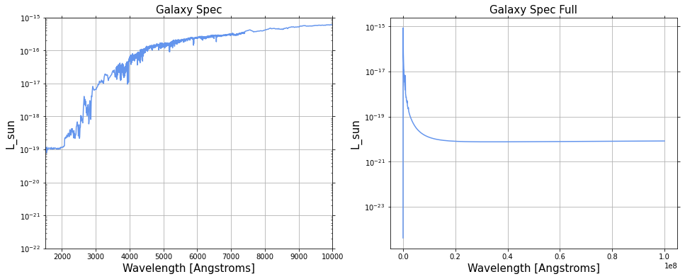

# Learning Prospector
## Alexandra Higley 

This week I am going to try to use model.predict (Prospector) to model a quiessent galaxy and a star forming galaxy from UV to midinfared. Might want to mess with metalicity and dust as well. We can check to see if these work if the SEDs look take on the shape that we expect (a star forming galaxy should have no emission, but a quiessent one should.) Star forming history parameter (sfh) should be set to a delayed tau:

$$
  SFR(t) = Ate^{-t/\tau}
$$

Note that this is a parametric star forming rate, and that the actual curve (when plotting time versus star forming rate in loglog space) is actually a lot more complicated. More recent models use non-paraemtric star forming rates, using histograms. 


```python
import numpy as np
import matplotlib
import matplotlib.pyplot as plt 
import matplotlib.ticker as ticker
from matplotlib import cm

import prospect
import fsps
import sedpy
```


```python
sps1 = fsps.StellarPopulation(compute_vega_mags=False, zcontinuous=1)
```


```python
sps1.params['sfh']=4 #setting sfh = 4 makes it so that a delayed tau model is used

sps1.params['imf_type']=2 #type of initial mass function. Just using the default.  
sps1.params['dust_type']=2
sps1.params['add_neb_emission']=True
sps1.params['dust1']=0

sps1.params['zred']=1
sps1.params['tage']=13.8 #Gyr. Unsure if this is the age of the galaxy though, or the universe
```


```python
spec1 = sps1.get_spectrum(tage = 13.7)
```


```python
fig = plt.figure(figsize=(16, 6))
ax1 = fig.add_subplot(121)
ax1.semilogy(spec1[0], spec1[1], color='cornflowerblue')

ax1.set_xlabel('Wavelength [Angstroms]',fontsize=15)
ax1.set_ylabel('L_sun',fontsize=15)

ax1.tick_params(axis='both',which='minor',direction='in')
ax1.tick_params(top=True,right=True)
ax1.tick_params(which='minor',top=True,right=True)

ax1.set_ylim(1e-22, 1e-15)
ax1.set_xlim(1500,10000) #okayy !!

ax1.set_title("Galaxy Spec", fontsize = 15)
ax1.grid()

##########################################################

ax2 = fig.add_subplot(122)
ax2.semilogy(spec1[0], spec1[1], color='cornflowerblue')

ax2.set_xlabel('Wavelength [Angstroms]',fontsize=15)
ax2.set_ylabel('L_sun',fontsize=15)

ax2.tick_params(axis='both',which='minor',direction='in')
ax2.tick_params(top=True,right=True)
ax2.tick_params(which='minor',top=True,right=True)

ax2.set_title("Galaxy Spec Full", fontsize = 15)
ax2.grid()

plt.show()
```


    

    


```python
from prospect.models.templates import TemplateLibrary
TemplateLibrary.show_contents()
```

    'type_defaults':
      Explicitly sets dust amd IMF types.
    'ssp':
      Basic set of (free) parameters for a delta function SFH
    'parametric_sfh':
      Basic set of (free) parameters for a delay-tau SFH.
    'dust_emission':
      The set of (fixed) dust emission parameters.
    'nebular':
      The set of nebular emission parameters, with gas_logz tied to stellar logzsol.
    'nebular_marginalization':
      Marginalize over emission amplitudes line contained inthe observed spectrum
    'fit_eline_redshift':
      Fit for the redshift of the emission lines separatelyfrom the stellar redshift
    'outlier_model':
      The set of outlier (mixture) models for spectroscopy and photometry
    'agn':
      The set of (fixed) AGN dusty torus emission parameters.
    'igm':
      The set of (fixed) IGM absorption parameters.
    'spectral_smoothing':
      Set of parameters for spectal smoothing.
    'optimize_speccal':
      Set of parameters (most of which are fixed) for optimizing a polynomial calibration vector.
    'fit_speccal':
      Set of parameters (most of which are free) for sampling the coefficients of a polynomial calibration vector.
    'burst_sfh':
      The set of (fixed) parameters for an SF burst added to a parameteric SFH, with the burst time controlled by `fage_burst`.
    'logm_sfh':
      Non-parameteric SFH fitting for log-mass in fixed time bins
    'continuity_sfh':
      Non-parameteric SFH fitting for mass in fixed time bins with a smoothness prior
    'continuity_flex_sfh':
      Non-parameteric SFH fitting for mass in flexible time bins with a smoothness prior
    'continuity_psb_sfh':
      Non-parameteric SFH fitting for mass in Nfixed fixed bins and Nflex flexible time bins with a smoothness prior
    'dirichlet_sfh':
      Non-parameteric SFH with Dirichlet prior (fractional SFR)
    'alpha':
      The prospector-alpha model, Leja et al. 2017


```python
model_params = TemplateLibrary["parametric_sfh"]
print(describe(model_params))
```

    Free Parameters: (name: prior) 
    -----------
      mass: <class 'prospect.models.priors.LogUniform'>(mini=100000000.0,maxi=1000000000000.0)
      logzsol: <class 'prospect.models.priors.TopHat'>(mini=-2,maxi=0.19)
      dust2: <class 'prospect.models.priors.TopHat'>(mini=0.0,maxi=2.0)
      tage: <class 'prospect.models.priors.TopHat'>(mini=0.001,maxi=13.8)
      tau: <class 'prospect.models.priors.LogUniform'>(mini=0.1,maxi=30)
    
    Fixed Parameters: (name: value [, depends_on]) 
    -----------
      zred: 0.1 
      sfh: 4 
      imf_type: 2 
      dust_type: 0 


```python

```
